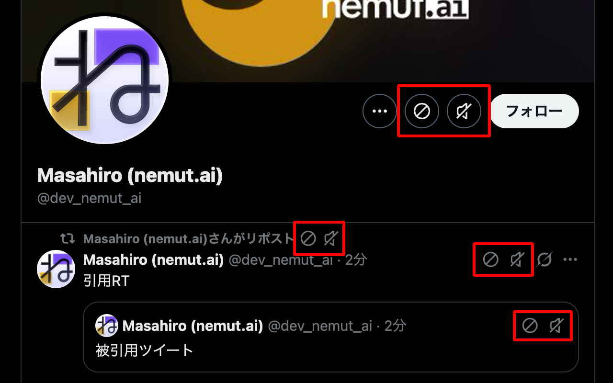

# Ultimate Twitter Block

[](https://chromewebstore.google.com/detail/ljfgdpcinehhgcfcjalfidjbhnnjcgdn)
[](https://chromewebstore.google.com/detail/ljfgdpcinehhgcfcjalfidjbhnnjcgdn)
[](https://github.com/satomasahiro2005/ultimate-twitter-block/releases)
[](LICENSE)



Twitterの究極のブロックツール。ツイート・RT・引用RT・プロフィールすべてにワンクリックのブロック＆ミュートボタンを追加するブラウザ拡張機能です。TwitterのUIに完全に溶け込むデザインで、違和感なく使えます。

[](https://chromewebstore.google.com/detail/ljfgdpcinehhgcfcjalfidjbhnnjcgdn)

## 特徴

- TwitterのネイティブUIに完全に馴染むデザイン
- 軽量で高速：パフォーマンスに影響しません
- ブロック・ミュートボタンの表示/非表示を個別に設定可能
- フォロー中のユーザーをブロックする前に確認する機能
  - **デフォルトでオンにしました！！(v2.2.3)**
- 統計機能：ブロック・ミュート回数を記録
- 日本語 / English 対応

## 機能

### ブロック
見たくないユーザーをワンクリックで排除します。ブロックされたユーザーのツイートはタイムラインに表示されなくなり、あなたのプロフィールも閲覧できなくなります。

### ミュート
フォローしているけどタイムラインには表示したくないユーザーをワンクリックで非表示にします。フォロー関係はそのまま維持されますが、そのユーザーのツイートはTLに流れなくなります。

### リツイート対応
リツイート(リポスト)にも対応。「○○さんがリポスト」の横にRT者用のブロック・ミュートボタンが表示され、ツイート本体には元の投稿者用のボタンが表示されます。RTで流れてくる不快なツイートの元凶を即ブロックできます。

## ボタンの表示場所

- タイムラインのツイート
- リツイート(RT者 + 元の投稿者を個別に対応)
- プロフィールページ
- おすすめユーザー(You might like)
- フォロー/フォロワー一覧
- 引用ツイート
- ホバーカード

## インストール

### Chrome (推奨)

[**Chrome ウェブストアからインストール**](https://chromewebstore.google.com/detail/ljfgdpcinehhgcfcjalfidjbhnnjcgdn)

### Firefox

1. [Releases](https://github.com/satomasahiro2005/ultimate-twitter-block/releases)から最新のZIPをダウンロード
2. `about:debugging#/runtime/this-firefox` を開く
3. 「一時的なアドオンを読み込む」でZIPファイルを選択

### ユーザースクリプト (Tampermonkey / Violentmonkey)

[**twitter-block.user.js をインストール**](https://raw.githubusercontent.com/satomasahiro2005/ultimate-twitter-block/main/userscripts/twitter-block.user.js)

バージョンが更新されるとTampermonkey/Violentmonkeyが自動で更新通知を出します。

> **Note:** ユーザースクリプト版では設定は固定です（ブロック・ミュートボタン両方表示、フォロー中ユーザーをブロックする前に確認）。設定を変更したい場合はChrome拡張版をご利用ください。

## ビルド

```bash
node build.js            # ZIP + ユーザースクリプト両方
node build.js zip        # ZIPのみ
node build.js userscript # ユーザースクリプトのみ
```

## 対応言語

- 日本語
- English
- 简体中文

## ライセンス

MIT

## クレジット

フォールバック用の一部アイコンに [Material Design Icons](https://github.com/google/material-design-icons)（Apache License 2.0）を使用しています。

